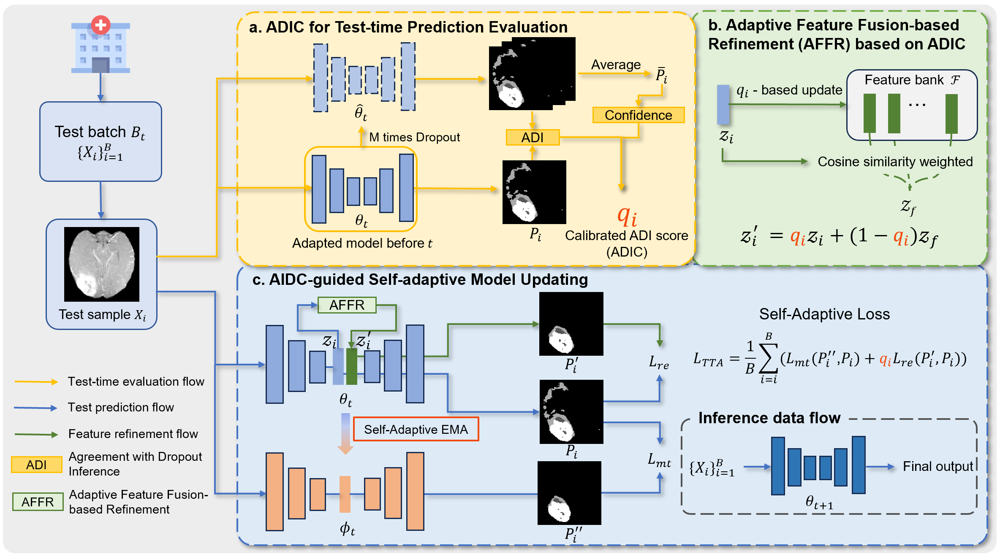

# TEGDA: Test-time Evaluation-Guided Dynamic Adaptation for Medical Image Segmentation
---
This is the official code for TEGDA: Test-time Evaluation-Guided Dynamic Adaptation for Medical Image Segmentation.

[2025-06] Our work have been accepted by MICCAI 2025.


## Overall Framework


Our contributions are summarized as follows:
- We present a novel prediction quality evaluation metric based on **Agreement with Dropout Inferences calibrated by Confidence (ADIC)**, where the Dice score between predictions by the model and its dropout version is leveraged to assess the robustness of the model on a testing sample, then it is further calibrated by the confidence to become highly relevant to the real Dice value between the prediction and its ground-truth
- We propose **Adaptive Feature Fusion-based Refinement (AFFR)** that adaptively fuses the feature of a sample with those with high ADIC values based on their similarity, leading to robust refined pseudo-labels.
- We introduce ADIC-guided **Self-adaptive Model Updating (SMU)** that consists of ADIC-aware pseudo-label loss weighting and ADIC-aware mean teacher to improve the stability of adaptation.

## Dataset
Download the BraTS-GLI and BraTS-PED datasets from [BraTS 2023](https://www.synapse.org/#!Synapse:syn51156910/wiki/), M&Ms datasets from [M&Ms](http://www.ub.edu/mnms).

## How to use
### Source model training
Use
```
cd code
python train_fully_supervised_2D.py # For M&Ms dataset
python train_fully_supervised_3D.py # For BraTS dataset
```
to get the source model for two datasets.

### Test-time adaptation
Use
```
./run.sh
```
to get the test-time adaptation results on two datasets.